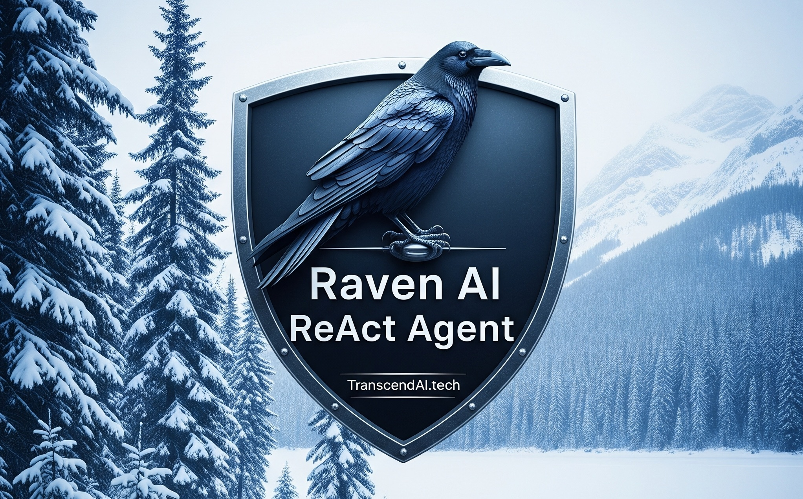

# RulesGPU
A rules engine with GPU support. 
 
RulesGPU is a DMN 1.3 decision-table rules engine that compiles every rule condition into TorchSharp tensors and evaluates them in parallel on the fastest available device (CUDA GPU or CPU). It is stateless, deterministic, and optimized for bulk “record-against-table” classification, supporting the FIRST, UNIQUE, and COLLECT hit policies across numeric, string, boolean, and date types. 
 
Pure C#, no binaries. No dependencies except for Microsoft's unit testing and TorchSharp.
 
[GUI Guide, use the GUI to run the rules engine.](GUIGuide.md) 
[Developer Guide, use the rules engine in your own app.](DeveloperGuide.md) 
[Code Description, analyze how the rules engine works.](CodeDescription.md) 
 
RulesGPU is free for non-commercial use, free to test. You need a commercial license to use it commercially. A commercial license is $100 Canadian. 
[Non-commercial license.](License.txt) 
[Commercial license, purchasing info.](https://transcendai.tech/paylanding.html) 
 
RulesGPU was built with Raven. Raven is an autonomous AI ReAct agent with first class C# code generation support. 
[Raven, 10x coder = 1/10 cost.](https://transcendai.tech) 

 
Copyright [TranscendAI.tech](https://TranscendAI.tech) 2025. 
Authored by Warren Harding. AI assisted. 
